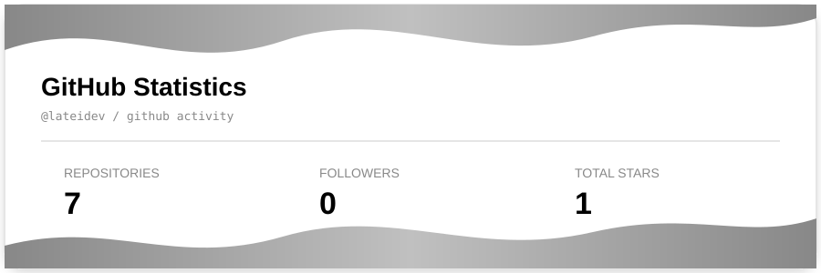
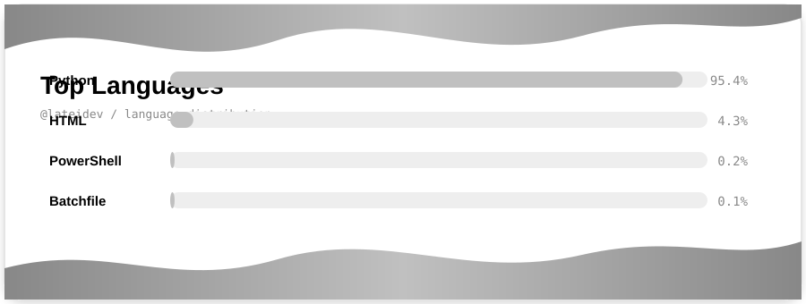

  <picture style="background-color: #ffffff; display: block; border-radius: 10px; overflow: hidden;">
    
  </picture>

 

  

  

  
  &nbsp;
  
  &nbsp;
  
  &nbsp;
  

  

  

 

  <picture style="background-color: #ffffff; display: inline-block; width: 85%; border-radius: 10px; overflow: hidden;">
    
  </picture>

 

  

 

  <picture style="background-color: #ffffff; display: inline-block; width: 85%; border-radius: 10px; overflow: hidden;">
    
  </picture>

 

  

 

  <picture style="background-color: #ffffff; display: block; border-radius: 10px; overflow: hidden;">
    
  </picture>

